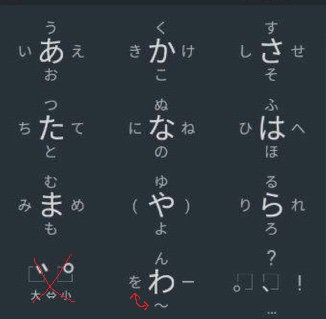

## japanese-directional-keyboard

### Table of Contents
1. [What it is](#what-it-is)
2. [How it works](#how-it-works)
   1. [Some important shortcuts](#some-important-shortcuts)
3. [How to Install](#how-to-install)
5. [Support](#support)
   1. [Donations](#donations)

### What it is

japanese-directional-keyboard is aimed at mimicking the advantages of the phone layout with it's intuitive and straightforward approach to character creation while leveraging some benefits the layout and extra keys a regular computer keyboard provides.
My design is focused on maximising intuitivity, comfort and speed for every action.

### How it works

The numpad acts as the input you would see on a phone.

(with the beautifully depicted practical and semantic updates)

Each key corresponds to a character ending in an 'a' あ sound, in other words: さかあはなたらやまわ

On the phone, to produce characters ending in a different vowel, you can hold the key and swipe into one of the four cardinal directions to modify it, resulting in ueoi, うえおい.
To mimick this directional change on the keyboard, follow each character by wasd, each corresponding to its direction, up left down right.

A deviation I've taken from the phone layout is the softening and hardening of sounds. To achieve these, you precede the corresponding character with 'q' for softening or 'e' for hardening.

Some examples for clarification:

- qか -> が
- qかw -> がw -> ぐ

- eは -> ぱ
- eはs -> ぱs -> ぽ

っ is created using 'xた' based on official IME's usage of 'x'.

Combination characters can also be created by adding a 'y' to the corresponding character taking its consonant as the base and the vowel as its modifier.

- かy -> きゃ
- かwy -> くy -> きゅ

Of course this also works for soft and hard characters.

- qかy -> がy -> ぎゃ
- eはsy -> ぱsy -> ぽy -> ぴょ

#### Some important shortcuts

- Ctrl + NumLock (key on the top left of numpad) -> Toggle conversion on/off
- Ctrl + Escape -> exit application

Depending on the state of NumLock, japanese-directional-keyboard outputs either hiragana or katakana. By default, NumLock off outputs hiragana, NumLock on outputs katakana. 

### How to install

All you need is a working installation of AHK (Auto Hotkey) and my script provided under the releases section.

If you haven't installed AHK yet, procede to the [official site](https://www.autohotkey.com/) and follow the instructions there.

Afterwards, simply run the mentioned script and you're good to go.

### Support

If you enjoyed this, feel free to check out my other quality-of-life tools, all free and open-source as well, no ads and no nonsense.

- _ShutDownEr_: https://github.com/JohnStephens1/ShutDownEr
- _Timerrhymer_: https://github.com/JohnStephens1/Timerrhymer
- _4Focus_: https://github.com/JohnStephens1/4Focus

#### Donations

If you found any of them useful, sharing my work with people who might profit from them would be highly appreciated.

Alternatively, any and every donation would mean a lot and help me stay open-source and free.

https://www.paypal.com/donate/?hosted_button_id=L4X2DFAYMJ72U